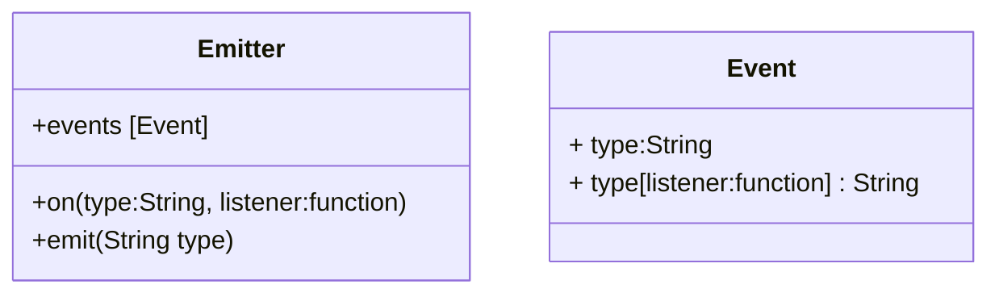

# Events and Event Emiters

Event := occurence that has happened to which we can react

In node 2 different kind of events:

- System Events (comes from C++ core, `libuv`)
- Custom Events (JavaScript Core, **Event Emitter**)

Event listeners is an array of functions executed one by one, see below

> listeners are functions sitting in an array

```js
// using on suggests an event listener
Emitter.prototype.on = function (type, listener) {
  // if this property does not exist make a new array
  this.events[type] = this.events[type] || [];
  // push listener a.k.a. a function executing when it happens
  this.events[type].push(listener);
};

// emit a.k.a. carry out operation since something happened
Emitter.prototype.emit = function (type) {
  // look if such type of an event exists
  if (this.events[type]) {
    // execute every listener function that is associated with an event type
    this.events[type].forEach(function (listener) {
      listener();
    });
  }
};
```

## Architecture of event emitter 



System Events are translated as Custom Event

> There is no concept of event in JavaScript, it's "faked"

magic string: a string that has a special meaning in the code
-> relying on magic strings may be problematic and error prone

To make sure no such problem occurs establish a `config.js` with events

both `call` and `apply` works the same as invocation of function using `()`
first argument (object) becomes the context to which `this` variable points
the difference:

- `call()`: arguments are seperated by `arg1,arg2,arg3`
- `apply()`: arguments are passed in an array `[arg1, arg2, arg3]`

```js
obj.greet.call({ example: "example" }, arg1, arg2, arg3);
//vs
obj.greet.apply({ example: "example" }, [arg1, arg2, arg3]);
```

note: `bind()` works the same as `call()`, only that it returns a new function with bounded context
